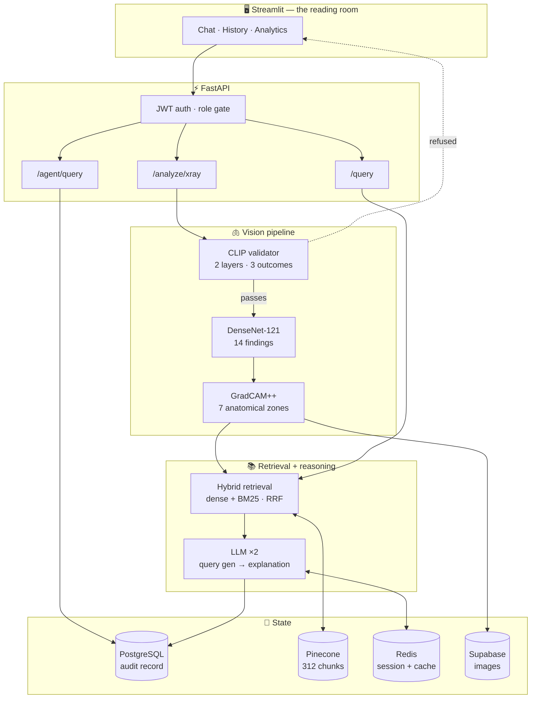
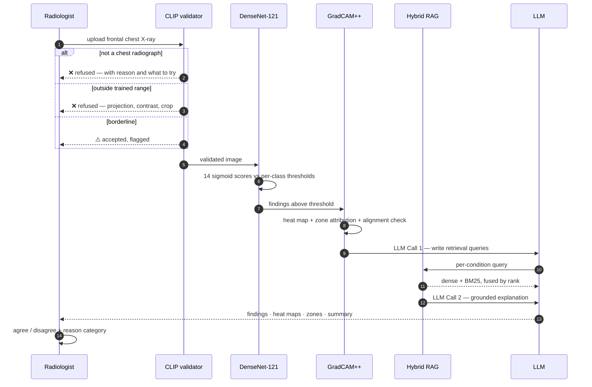

<div align="center">

# Thoragrid

**A chest radiograph reading assistant that shows its work — and knows when to refuse.**

Fourteen findings, localised to anatomy, explained from clinical literature,
and questionable in plain language.

[](https://www.python.org)
[](https://fastapi.tiangolo.com)
[](https://streamlit.io)
[](https://pytorch.org)
[](#testing)

</div>

https://github.com/user-attachments/assets/8ca0a0ce-397d-4d72-9f61-db01c8baad20

---

## The problem this is built around

A chest radiograph AI that reports findings is easy. One that a radiologist can
*audit* is not.

Most tools return a label and a confidence score. That leaves the reader with no
way to answer the only question that matters at the point of care: **should I
trust this particular output, on this particular image?**

Thoragrid answers it three ways.

| | |
|---|---|
| **It shows where it looked** | Every reported finding gets a heat map and named anatomical zones — and a flag when that location is *atypical* for the finding claimed. |
| **It shows what it nearly said** | All fourteen scores are always visible, not just the ones that crossed threshold. A 0.66 sitting under a 0.70 cut-off is exactly what a reader needs to see. |
| **It refuses** | An image that is not a chest radiograph is rejected. One that is, but sits outside the trained distribution, is either rejected or accepted *with a caution flag*. Nothing silently gets read. |

---

## What makes this different: the claims are measured

Most portfolio projects assert that a component works. This one has numbers, and
some of them contradicted the assumptions that motivated the work.

<details open>
<summary><b>Case study: the input validator that wasn't broken</b></summary>

<br>

The project began with a suspected bug — the CLIP validator seemed to be letting
non-chest images through. Rather than replacing it, a labelled evaluation set was
built: **250 held-out NIH chest X-rays**, **80 non-chest radiographs**, **100
deliberately degraded chest films**, and **20 non-medical images**.

The measurement found the opposite of what was assumed:

| Stratum | AUROC vs. positives | Verdict |
|---|---|---|
| Non-chest radiographs | **1.000** | Perfectly separated |
| Non-medical images | **1.000** | Perfectly separated |
| Degraded chest films | 0.963 | The genuinely hard case |

CLIP was not the problem. The real defect was in the opposite direction and
nobody was looking for it: the threshold, calibrated as `mean + 1.5σ` on
positives alone, was **rejecting 26 of 250 genuine chest X-rays — one study in
ten.**

The fix replaced a single hard cut with two bands, chosen against the measured
distribution rather than a σ multiplier:

```
distance ≤ 0.34   →  accept
0.34 … 0.46       →  accept, flagged as outside the trained range
distance > 0.46   →  refuse
```

Re-banding the same measured distances:

| Stratum | Accepted clean | Flagged | Refused |
|---|---:|---:|---:|
| **Genuine chest X-rays** (250) | 244 | 6 | **0** |
| Non-chest radiographs (80) | 0 | 0 | **80** |
| Non-medical (20) | 0 | 0 | **20** |
| Degraded chest films (100) | 45 | 41 | 14 |

**Zero genuine studies refused, down from 26 — and every genuinely invalid input
still rejected.**

> The image that triggered the original investigation turned out to be a real
> chest X-ray from a non-NIH source. Accepting it was correct behaviour. Without
> the measurement, a working component would have been replaced while the actual
> bug shipped.

</details>

<details>
<summary><b>Case study: hybrid retrieval, inspected rather than assumed</b></summary>

<br>

Retrieval fuses dense embeddings with BM25 by **Reciprocal Rank Fusion**
(Cormack et al., SIGIR 2009). Rank-based fusion is used deliberately: cosine
similarity lives in `[-1, 1]` while BM25 is unbounded and corpus-dependent, so
any weighted sum needs a normalisation constant that must be re-tuned per corpus
and rots silently when the corpus changes. Ranks have no units.

A side-by-side comparison script (`scripts/compare_retrieval.py`) exists to
answer one question honestly: **does the lexical half change anything at all?**

Across six probe queries it changed **17 of 24 ranked positions**. Inspecting the
chunks it surfaced showed both a clear win and a clear failure:

- ✅ `tension pneumothorax needle decompression` surfaced *"Do not let a chest
  radiograph or CT delay…"* — the core teaching point, which dense retrieval
  missed entirely.
- ❌ `honeycombing usual interstitial pneumonia` matched the token *"pneumonia"*
  against infectious pneumonia content, though UIP is a fibrosis pattern.

**Six queries cannot establish that hybrid is better — and the README will not
claim it does.** What it establishes is that the lexical half is doing work, and
where it fails. Settling the question needs a labelled retrieval benchmark, which
is documented as outstanding rather than quietly skipped.

</details>

---

## The dataset, and why the label space matters

Trained on **NIH ChestX-ray14** — 112,120 frontal radiographs from 30,805 patients,
carrying **81,176 finding annotations** across fourteen pathologies.

The distribution is steep, and deliberately not flattened:

| Finding | Images | Share of annotations |
|---|---:|---:|
| Infiltration | 19,894 | 24.5% |
| Effusion | 13,317 | 16.4% |
| Atelectasis | 11,559 | 14.2% |
| Nodule | 6,331 | 7.8% |
| Mass | 5,782 | 7.1% |
| Pneumothorax | 5,302 | 6.5% |
| Consolidation | 4,667 | 5.7% |
| Pleural Thickening | 3,385 | 4.2% |
| Cardiomegaly | 2,776 | 3.4% |
| Emphysema | 2,516 | 3.1% |
| Edema | 2,303 | 2.8% |
| Fibrosis | 1,686 | 2.1% |
| Pneumonia | 1,431 | 1.8% |
| **Hernia** | **227** | **0.3%** |

**88:1 between the most and least common finding.** That imbalance drives two
design decisions elsewhere in this repository: Focal Loss (γ=2.0) with per-class
`pos_weight` during training, and **per-class thresholds optimised individually
on the validation set** rather than one global 0.5 cut. A single threshold across
a distribution this skewed would silence Hernia entirely.

### A chest X-ray is not a single-label problem

Findings co-occur. Emphysema with pneumothorax, effusion with atelectasis,
infiltration with consolidation — the normal case, not the edge case. **20,796
images (18.5%) carry more than one finding**, and one carries nine.

Fourteen findings in any combination give `2^14` = **16,384 expressible label
states** — 16,383 pathology combinations plus the no-finding state. **801 of them
appear in the data.**

That is 4.89% of the arithmetic space, and the number needs reading carefully,
because the depth breakdown shows it is not a gap in the data:

| Findings per image | Combinations observed | Possible | Coverage | Images |
|---:|---:|---:|---:|---:|
| 0 *(No Finding)* | 1 | 1 | 100% | 60,361 |
| 1 | 14 | 14 | **100%** | 30,963 |
| 2 | 89 | 91 | **98%** | 14,306 |
| 3 | 238 | 364 | 65% | 4,856 |
| 4 | 256 | 1,001 | 26% | 1,247 |
| 5 | 144 | 2,002 | 7% | 301 |
| 6 | 42 | 3,003 | 1% | 67 |
| 7 | 14 | 3,432 | <1% | 16 |
| 8 | 1 | 3,003 | <1% | 1 |
| 9 | 2 | 2,002 | <1% | 2 |

**Every single finding and 98% of every possible pair occurs in the data.**
Coverage thins only as combinations stop being clinically plausible — twelve
simultaneous findings on one radiograph is a number, not a patient. The 4.89%
headline is an artefact of a denominator that counts medically impossible states,
not evidence of missing data.

### The model is not limited to the 801

It emits **fourteen independent sigmoids**, each compared against its own
threshold. A combination absent from training is still representable at
inference. A softmax over observed label-sets could only ever return one of the
801 it had seen; this architecture cannot be cornered that way.

The honest counterpart: **293 combinations appear exactly once**, and most of the
deeper ones never appear at all, so per-combination performance is unmeasurable
across the tail. That is precisely why evaluation here is **per-finding** —
thresholds tuned per class on a validation split — and never per-combination.

<details>
<summary><b>Verifying these figures yourself</b></summary>

<br>

`scripts/verify_label_space.py` recomputes every number above from
`Data_Entry_2017.csv`.

```bash
python scripts/verify_label_space.py
```

It normalises label order before counting, so `Effusion|Mass` and `Mass|Effusion`
resolve to one combination rather than two. It also checks the assumption the
arithmetic rests on — that `No Finding` never co-occurs with a pathology — and
refuses to report coverage if it fails, because the empty-subset mapping would no
longer hold and every derived figure would be quietly wrong.

Two independent computations agree to the digit, which is the reason to trust
them: summing `depth × images` across the table above yields **81,176
annotations**, exactly the total obtained by counting each of the fourteen labels
separately. The depth table and the per-label distribution are derived by
different routes from the same CSV and meet at the same number.

</details>

---

## Architecture



---

## How a study flows through



---

## Features

<table>
<tr><td width="50%" valign="top">

### 🩻 Read a study
Upload a frontal chest radiograph. Get fourteen scores, heat maps for whatever
crossed threshold, the anatomical zones that drove each one, and a written
explanation grounded in retrieved literature.

</td><td width="50%" valign="top">

### 💬 Question the result
Follow-up questions stay attached to the case. *"What would explain that
distribution?"* is answered in the context of what was just read — image findings
travel with the conversation.

</td></tr>
<tr><td valign="top">

### 📋 Permanent record
Every reading and question is kept. Opening a case replays the full thread,
study, heat maps and zones. Closing a case clears working memory only — never
the record.

</td><td valign="top">

### ✅ Structured feedback
Agree in one click. Disagree in two, choosing *why*: missed finding, false
positive, localisation off, severity wrong. A bare disagreement records that
something was wrong without recording what.

</td></tr>
<tr><td valign="top">

### 📊 Ask your own record
Natural language → read-only SQL over your reading history, answered in plain
language with the figures beside it. Doctors see their own cases; admins see all.

</td><td valign="top">

### 🔒 Scoped by role
JWT auth with server-side session resume. The SQL agent runs as a read-only
Postgres role with `sqlglot` AST validation and automatic `doctor_id` scoping —
not regex filtering.

</td></tr>
</table>

---

## Analytics, in motion

Ask the reading record a question in plain language. The answer comes back in
prose, and **the chart form is chosen from the shape of the result** — not
applied uniformly.

https://github.com/user-attachments/assets/bde83fac-422f-42ea-9593-a60217072d85

---

## Tech stack

| Layer | Choice | Why |
|---|---|---|
| **Dataset** | NIH ChestX-ray14 — 112,120 images, 81,176 annotations | 14 findings, multi-label; 88:1 class imbalance |
| **Classification** | DenseNet-121, NIH ChestX-ray14 | Focal Loss (γ=2.0) with per-class `pos_weight`; per-class F1-optimised thresholds |
| **Explainability** | GradCAM++ on `denseblock4` | Per-condition heat maps, not a composite blend — clinical clarity over convenience |
| **Zone attribution** | 7-zone schematic (Felson, 1973) | 6 pulmonary + 1 cardiac/mediastinal, with expected-zone alignment checking |
| **Input validation** | CLIP ViT-B/32, two layers | Prompt scoring + prototype distance, three outcomes |
| **Retrieval** | PubMedBERT embeddings + BM25, RRF | Domain-tuned dense recall plus exact-term matching |
| **Knowledge base** | Open-I + StatPearls | 312 chunks, metadata-filtered per condition |
| **LLM** | `openai/gpt-oss-20b` on Groq | Structured JSON output; `reasoning_effort="low"` |
| **Backend** | FastAPI + SQLAlchemy | Full audit trail in PostgreSQL |
| **Frontend** | Streamlit | Custom design system, no default styling |
| **State** | Redis · Supabase · Pinecone | Session memory · image storage · vectors |

---

## Getting started

### Prerequisites

Accounts required: **Supabase** (Postgres + Storage), **Pinecone**, **Groq**,
**Upstash Redis**, **HuggingFace** (model weights).

<details>
<summary><b>1 · Install</b></summary>

```bash
git clone https://github.com/Nauviii/Thoragrid.git
cd Thoragrid

python -m venv .venv
source .venv/bin/activate        # Windows: .venv\Scripts\activate

pip install -r requirements.txt
```

</details>

<details>
<summary><b>2 · Configure</b></summary>

Copy `.env.example` to `.env` and fill every value — all nine are required and
the app will refuse to start without them:

```env
JWT_SECRET_KEY=            # 32+ bytes
GROQ_API_KEY=
DATABASE_URL=              # postgresql+psycopg2://…
SQL_AGENT_READONLY_URL=    # read-only role, see below
SUPABASE_URL=
SUPABASE_SERVICE_KEY=
PINECONE_API_KEY=
REDIS_URL=
MODEL_REPO_ID=             # HuggingFace repo holding multilabel_model.pt
```

> **`SQL_AGENT_READONLY_URL` is not optional.** The analytics agent must connect
> as a Postgres role with `SELECT` only. Guardrails are defence in depth, not the
> only line of defence.

</details>

<details>
<summary><b>3 · Initialise data stores</b></summary>

```bash
# Tables
python scripts/db_init.py
python scripts/seed_users.py          # creates admin + doctor demo accounts

# Knowledge base → Pinecone (768-dim index, cosine)
python scripts/fetch_statpearls.py
python scripts/ingest_statpearls.py
```

The ingestion run also writes `models/weights/bm25_corpus.json` — the lexical
half of retrieval reads it at query time. If the final line of the run does not
report the corpus, hybrid retrieval silently degrades to dense-only.

</details>

<details>
<summary><b>4 · Run</b></summary>

```bash
# Terminal 1 — API
uvicorn api.main:app --reload --port 8000

# Terminal 2 — UI
streamlit run app/main.py
```

Open `http://localhost:8501`. API docs at `http://localhost:8000/docs`.

</details>

---

## API

| Method | Endpoint | Purpose |
|---|---|---|
| `POST` | `/auth/token` | Authenticate; returns JWT + opaque session key |
| `POST` | `/auth/resume` | Resume a session after browser reload |
| `DELETE` | `/auth/session` | Revoke a browser session immediately |
| `POST` | `/analyze/xray` | Full pipeline: validate → classify → localise → explain |
| `POST` | `/query` | Text Q&A with conversation memory |
| `GET` | `/history` | Paginated interaction history, role-scoped |
| `GET` | `/conversation/{id}` | Full transcript; image URLs re-signed per request |
| `DELETE` | `/conversation/{id}` | Close working memory; record is untouched |
| `POST` | `/feedback` | Agree/disagree with reason code |
| `POST` | `/agent/query` | Natural language → read-only SQL |

---

## Testing

**132 tests** across unit and integration suites.

```bash
pytest tests/unit -v              # pure logic, no external services
pytest tests/integration -v       # requires live Supabase, Pinecone, Redis, Groq
pytest --cov=core --cov=api       # coverage
```

Several tests exist specifically to stop documentation drifting from code:

- `test_system_overview.py` fails if the assistant's self-description names a
  condition the model does not classify, drops a validation outcome, or claims
  feedback retrains the model. It has already caught a real mismatch.
- `test_frontend_components.py` locks chart-selection rules and asserts that bar
  colours match `CONDITION_COLORS`, so a hue means the same thing in a badge, a
  heat map, and a chart.

---

## Engineering notes

<details>
<summary><b>Why two validation bands instead of one threshold</b></summary>

<br>

A single cut forces every borderline study into accept-or-reject. But an
inverted-greyscale or low-contrast chest film **is** a chest film — the CNN reads
the right anatomy, just less reliably. Refusing it costs a real study; flagging
it costs nothing.

The measured trade-off made the choice obvious: raising the cut-off from 0.27
toward 0.46 admitted **zero additional non-chest radiographs** across the whole
sweep. Every point of the false-positive increase came from degraded chest films
— the least dangerous negative in the set.

The reject boundary carries a documented scope limit: it was calibrated against
extremity radiographs only. Abdominal, thoracic-spine and pelvic films — the
anatomies nearest the chest field — remain untested, and the code says so.

</details>

<details>
<summary><b>Why reciprocal rank fusion, not weighted scores</b></summary>

<br>

Cosine similarity and BM25 are not commensurable. Combining them by weighted sum
requires a normalisation constant tuned per corpus, which silently becomes wrong
when the corpus or the encoder changes. RRF compares positions instead of
magnitudes, so it needs no constant.

Candidates are drawn `3 × top_k` deep from each retriever, because fusion can
only reorder what it is given — asking each side for exactly `top_k` leaves
nothing for the other to promote.

</details>

<details>
<summary><b>Why the LLM's reasoning effort is pinned low</b></summary>

<br>

`gpt-oss-20b` is a reasoning model, and its reasoning tokens are drawn from the
same completion budget as the answer. At Groq's default effort a long instruction
set can consume the entire allowance before a single content token is emitted —
which the API reports as a schema failure with an *empty* `failed_generation`.

The generation was not malformed. There was none. Retrying cannot help: given the
same budget it fails identically every time. These calls format and summarise
material already assembled; they do not solve anything, so low effort suits them.

</details>

<details>
<summary><b>Deterministic guidance over generated apologies</b></summary>

<br>

When an upload is refused, the reason is already known exactly — no LLM is
involved in explaining it. Each rejection code maps to a fixed headline, an
explanation of the likely causes, and a concrete next step. A model asked to
apologise for a rejection will invent plausible-sounding causes; a lookup table
cannot.

The same principle governs the low-confidence path. When nothing crosses
threshold, the three highest scores are named and the *shape* of the
distribution is read — tightly grouped versus one clear leader — entirely
deterministically.

</details>

<details>
<summary><b>Signed URLs regenerated, not stored</b></summary>

<br>

Supabase signed URLs expire after an hour, which would break every image in a
case opened the next day. Because storage paths are deterministic
(`{image_hash}.png`, `{interaction_id}/{condition}.png`), URLs are re-signed on
every transcript request — recomputed from columns that already exist, with no
schema change. A per-image `try/except` degrades one missing object to a caption
rather than a 500.

</details>

---

## Known limits

Stated plainly, because a tool that hides these is harder to trust than one that
does not.

| Limit | Detail |
|---|---|
| **Fourteen findings only** | Anything outside the set is invisible. A below-threshold score is **not** evidence of absence. |
| **Frontal adult chests** | Lateral projections, paediatric studies and heavily processed images fall outside the trained range. |
| **Not a diagnostic device** | Decision support. Scores are model confidence, not probability of disease. |
| **Retrieval unbenchmarked** | Hybrid retrieval is inspected, not scored. A labelled benchmark is outstanding. |
| **Reject boundary scope** | Calibrated on extremity radiographs; abdominal, spine and pelvic films untested. |
| **Distribution shift** | Trained on NIH ChestX-ray14. Performance on other scanners and populations is unmeasured. |

---

## Project structure

```
thoragrid/
├── api/                  FastAPI — routes, schemas, auth middleware
├── app/                  Streamlit — views, components, design system
│   ├── components/       chat bubbles · zone grid · charts · feedback
│   └── views/            chat · history · analytics
├── core/
│   ├── cnn/              DenseNet-121 inference
│   ├── clip/             two-layer input validator
│   ├── gradcam/          GradCAM++ and the 7-zone region map
│   ├── rag/              chunking · hybrid retrieval · BM25 index
│   ├── llm/              prompts · orchestrator · guardrails · cache
│   ├── sql_agent/        NL→SQL with sqlglot AST guardrails
│   ├── memory/           Redis session memory · conversation history
│   └── storage/          Supabase signed URLs
├── scripts/              db init · ingestion · evaluation · label-space verification
├── notebooks/            training · threshold optimisation · calibration
└── tests/                132 tests, unit + integration
```

---

## References

- Rajpurkar et al. (2017) — *CheXNet*, DenseNet-121 for chest radiographs
- Wang et al. (2017) — *ChestX-ray8*, the NIH dataset
- Chattopadhay et al. (2018) — *Grad-CAM++*
- Felson (1973) — *Chest Roentgenology*, the zone division
- Radford et al. (2021) — *CLIP*
- Cormack et al. (2009) — *Reciprocal Rank Fusion*, SIGIR
- Lee et al. (2018) — *A Simple Unified Framework for Detecting OOD Samples*, NeurIPS
- Sun et al. (2022) — *Out-of-Distribution Detection with Deep Nearest Neighbors*, ICML

---

<div align="center">

**Thoragrid** — thorax, gridded.

*Built as a portfolio project. Not cleared for clinical use.*

</div>
