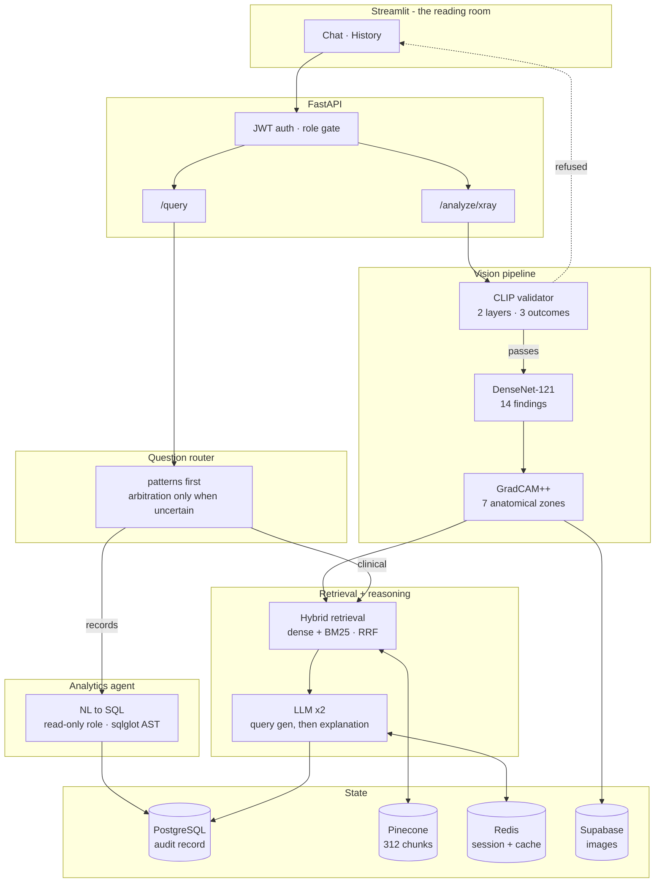
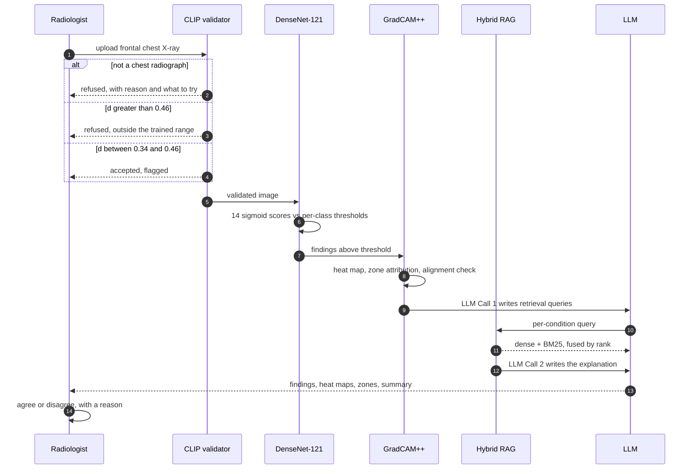

<div align="center">

# Thoragrid

**A chest radiograph reading assistant that shows its work — and knows when to refuse.**

Fourteen findings, localised to anatomy, explained from clinical literature,
and questionable in plain language.

[](https://www.python.org)
[](https://fastapi.tiangolo.com)
[](https://streamlit.io)
[](https://pytorch.org)
[](#testing)

</div>

---

## The problem this is built around

A chest radiograph AI that reports findings is easy. One that a radiologist can
*audit* is not.

Most tools return a label and a confidence score. That leaves the reader with no
way to answer the only question that matters at the point of care: **should I
trust this particular output, on this particular image?**

Thoragrid answers it three ways.

| | |
|---|---|
| **It shows where it looked** | Every reported finding gets a heat map and named anatomical zones — and a flag when that location is *atypical* for the finding claimed. |
| **It shows what it nearly said** | All fourteen scores are always visible, not just the ones that crossed threshold. A 0.66 sitting under a 0.70 cut-off is exactly what a reader needs to see. |
| **It refuses** | An image that is not a chest radiograph is rejected. One that is, but sits outside the trained distribution, is either rejected or accepted *with a caution flag*. Nothing silently gets read. |

---

## The input validator, in full

This is the part of the system with the most mathematics behind it, and the part
where measurement overturned the premise it was built on.

### Two questions, one embedding

An image `x` becomes a single 512-dimensional unit vector through CLIP ViT-B/32:

```
q = f(x) / ||f(x)||          q in R^512,  ||q|| = 1
```

Both layers read that one vector. They ask different things of it.

**Layer 1 — semantic.** *Is this the right kind of image?* Cosine similarity
against three prompts describing a chest radiograph and three describing
something else:

```
s_valid   = (1/3) * sum_i cos(q, t_i)     t_i: chest X-ray, thoracic radiograph, X-ray of the lungs
s_invalid = (1/3) * sum_j cos(q, u_j)     u_j: photograph, natural scene, document
pass  <=>  s_valid > s_invalid
```

**Layer 2 — distributional.** *Is it like what the CNN was trained on?* Distance
to a prototype centroid fitted on 500 stratified NIH samples:

```
c    = (1/N) * sum_k q_k          N = 500  (250 No Finding + 18 x 14 conditions)
d(x) = ||q - c||
```

The stratification matters: over half of NIH carries no finding at all, so an
unstratified draw would place the centroid on normal anatomy and treat pathology
itself as distributional drift.

### An identity worth establishing before choosing a metric

The original calibration justified Euclidean distance over cosine by citing
prototypical networks. For L2-normalised vectors against a fixed centroid, that
choice is empty:

```
||q - c||^2  =  ||q||^2 - 2(q.c) + ||c||^2
             =  1 - 2(q.c) + ||c||^2            since ||q|| = 1
```

`||c||` is constant, so `d` is a strictly decreasing function of `q.c`.
**Euclidean distance and cosine similarity produce identical rankings here**, and
thresholding one is thresholding the other. Verified numerically: identical
orderings, residual 4.4e-16.

That is worth knowing before defending a metric — and it rules out an entire
class of "try cosine instead" fixes.

### Why the original threshold failed

Calibration set `tau = mu + 1.5*sigma` over the 500-image draw. Two things are
wrong with that, and only one is obvious.

**It is fitted on positives alone.** The rule fixes how much of the *calibration
sample* falls outside. It says nothing whatever about out-of-distribution inputs,
because no negative enters the calculation at any point. The false-positive rate
is not merely unknown — it is undefined by construction.

**It does not survive the move to unseen data.** On 250 held-out studies the
distances are `mu = 0.2046`, `sigma = 0.0508`, and the calibrated `tau ~ 0.2702`
lands at

```
(tau - mu) / sigma  =  1.29 sigma        designed as 1.5 sigma
```

The distribution is right-skewed (skewness +1.52, excess kurtosis +3.21), so the
shift between the calibration sample and the population costs about three
percentage points. **The measured refusal rate on genuine chest X-rays was 26 of
250 — one study in ten.**

### What measurement actually found

A labelled evaluation set was built: **250 held-out NIH chest X-rays**, **80
non-chest radiographs**, **100 deliberately degraded chest films**, and **20
non-medical images**.

| Stratum | AUROC vs. positives | min distance | verdict |
|---|---:|---:|---|
| Non-chest radiographs | **1.000** | 0.6228 | perfectly separated |
| Non-medical images | **1.000** | 0.9480 | perfectly separated |
| Degraded chest films | 0.963 | 0.2300 | the genuinely hard case |
| *held-out positives* | — | *max 0.4443* | — |

CLIP was not the problem. Against non-chest radiographs the separation is
**complete** — a gap of `0.6228 - 0.4443 = 0.1785` with nothing inside it. The
defect was in the opposite direction, and nobody was counting.

### Two bands instead of one cut

A single threshold forces every borderline study into accept-or-reject. But an
inverted or low-contrast chest film **is** a chest film — the CNN reads the right
anatomy, just less reliably. Refusing it costs a real study; flagging it costs
nothing.

```
d <= 0.34            accept
0.34 < d <= 0.46     accept, flagged as outside the trained range
d > 0.46             refuse
```

**Where 0.34 comes from.** The 97.5th percentile of held-out positive distances
is 0.3327. Bootstrapping that quantile at n = 250 gives a 95% interval of
[0.299, 0.384], and the value barely moves with more data — 0.3325 at n = 250
against 0.3345 at n = 1000. Rounding to 0.34 accepts 97.6% of genuine studies
clean and flags 2.4%.

**Where 0.46 comes from.** It must sit inside the gap between the largest
positive (0.4443) and the smallest non-chest radiograph (0.6228). The midpoint is
0.5335; 0.46 sits deliberately below it, because the two errors are not
symmetric:

- letting a knee film through means the CNN reads the wrong anatomy and reports
  findings that cannot exist
- refusing a very poor chest film means the reader exports it again

At 0.46 no genuine study is lost — bootstrapped over 5,000 draws of 250
positives, the maximum never exceeded 0.4443 — while keeping a 0.163 margin below
the closest non-chest radiograph observed.

### The result, on the same measured distances

| Stratum | accepted clean | flagged | refused |
|---|---:|---:|---:|
| **Genuine chest X-rays** (250) | 244 | 6 | **0** |
| Non-chest radiographs (80) | 0 | 0 | **80** |
| Non-medical (20) | 0 | 0 | **20** |
| Degraded chest films (100) | 45 | 41 | 14 |

**Zero genuine studies refused, down from 26 — and every genuinely invalid input
still rejected.**

### Three files, run through the shipped system

| Image | `d` | Band | Outcome |
|---|---:|---|---|
| NIH frontal, unmodified | **0.2436** | <= 0.34 | accepted |
| Chest film, another source | **0.3585** | 0.34 - 0.46 | accepted, flagged |
| Hand radiograph | **0.6485** | > 0.46 | refused |

The hand radiograph is the instructive one: **Layer 1 passed it.** Every negative
prompt in Layer 1 names a non-radiograph category, so a knee or hand film beats
them trivially — the layer is blind to other anatomy by construction. Layer 2 is
what stopped it, and the measurement says so: across all 80 non-chest
radiographs, Layer 1 caught **zero**.

### Scope limit, stated in the code

The reject boundary was calibrated against extremity radiographs. Abdominal,
thoracic-spine and pelvic films — the anatomies nearest the chest field — remain
untested, and `config/settings.py` says so beside the constant.

---

<details>
<summary><b>Hybrid retrieval, inspected rather than assumed</b></summary>

<br>

Retrieval fuses PubMedBERT dense embeddings with BM25 by **Reciprocal Rank
Fusion** (Cormack et al., SIGIR 2009):

```
score(d) = sum_i  1 / (k + rank_i(d))        k = 60
```

Rank-based fusion is used deliberately. Cosine lives in `[-1, 1]` while BM25 is
unbounded and corpus-dependent, so any weighted sum needs a normalisation
constant that must be re-tuned per corpus and rots silently when the corpus
changes. Ranks carry no units.

Across six probe queries hybrid changed **17 of 24 ranked positions**, with one
clear win and one clear failure:

- `tension pneumothorax needle decompression` surfaced the teaching point — do
  not let imaging delay decompression — that dense retrieval missed entirely.
- `honeycombing usual interstitial pneumonia` matched the token *pneumonia*
  against infectious content, though UIP is a fibrosis pattern.

**Six queries cannot establish that hybrid is better, and this README does not
claim it does.** What they establish is that the lexical half does work, and
where it breaks. Settling the question needs a labelled retrieval benchmark,
which is documented as outstanding rather than quietly skipped.

</details>

---

## The dataset, and why the label space matters

Trained on **NIH ChestX-ray14** — 112,120 frontal radiographs from 30,805 patients,
carrying **81,176 finding annotations** across fourteen pathologies.

| Finding | Images | Share | Finding | Images | Share |
|---|---:|---:|---|---:|---:|
| Infiltration | 19,894 | 24.5% | Pleural Thickening | 3,385 | 4.2% |
| Effusion | 13,317 | 16.4% | Cardiomegaly | 2,776 | 3.4% |
| Atelectasis | 11,559 | 14.2% | Emphysema | 2,516 | 3.1% |
| Nodule | 6,331 | 7.8% | Edema | 2,303 | 2.8% |
| Mass | 5,782 | 7.1% | Fibrosis | 1,686 | 2.1% |
| Pneumothorax | 5,302 | 6.5% | Pneumonia | 1,431 | 1.8% |
| Consolidation | 4,667 | 5.7% | **Hernia** | **227** | **0.3%** |

**88:1 between the most and least common finding.** That imbalance drives three
decisions elsewhere: Focal Loss with per-class `pos_weight`, per-class thresholds
optimised individually on validation, and a patient-level split.

### A chest X-ray is not a single-label problem

Findings co-occur. **20,796 images (18.5%) carry more than one**, and one carries
nine. Fourteen findings in any combination give `2^14` = **16,384 expressible
label states** — 16,383 pathology combinations plus the no-finding state. **801 of
them appear in the data.**

| Findings per image | Observed | Possible | Coverage | Images |
|---:|---:|---:|---:|---:|
| 0 *(No Finding)* | 1 | 1 | 100% | 60,361 |
| 1 | 14 | 14 | **100%** | 30,963 |
| 2 | 89 | 91 | **98%** | 14,306 |
| 3 | 238 | 364 | 65% | 4,856 |
| 4 | 256 | 1,001 | 26% | 1,247 |
| 5-9 | 203 | 13,442 | 2% | 387 |

**Every single finding and 98% of every possible pair occurs.** Coverage thins
only as combinations stop being clinically plausible — twelve simultaneous
findings on one radiograph is a number, not a patient.

**The model is not limited to the 801.** It emits fourteen independent sigmoids,
each against its own threshold, so a combination absent from training is still
representable. A softmax over observed label-sets could only return one of the
801 it had seen.

The honest counterpart: **293 combinations appear exactly once**, so
per-combination performance is unmeasurable across the tail. That is why
evaluation is per-finding.

<details>
<summary><b>Verifying these figures yourself</b></summary>

<br>

`scripts/verify_label_space.py` recomputes every number above from
`Data_Entry_2017.csv`. It normalises label order before counting and checks the
assumption the arithmetic rests on — that `No Finding` never co-occurs with a
pathology.

Two independent computations agree to the digit: summing `depth x images` yields
**81,176 annotations**, exactly the total from counting each label separately.

</details>

---

## Results

**Mean AUC 0.8214** across 14 findings, on a patient-level split.

| Model | Mean AUC | |
|---|---:|---|
| ConvFormer (2025) | 0.841 | |
| CheX-DS ensemble | 0.8376 | |
| Best DenseNet-121 | 0.826 | |
| **Thoragrid** | **0.8214** | single model, patient-level split |
| CLARiTy ViT | 0.818 | |

### Mean F1 is 0.31. That is the ceiling, not the model.

F1 is bounded by separability and base rate together. Modelling each class as a
binormal ROC at its measured AUC and prevalence gives the highest F1 any
threshold could reach:

| Condition | Prevalence | AUC | F1 observed | Ceiling | % of ceiling |
|---|---:|---:|---:|---:|---:|
| Hernia | 0.2% | 0.933 | 0.354 | 0.205 | 172% |
| Emphysema | 2.2% | 0.917 | 0.438 | 0.404 | 108% |
| Effusion | 11.9% | 0.870 | 0.504 | 0.529 | 95% |
| Pneumonia | 1.3% | 0.714 | 0.088 | 0.081 | 109% |
| Infiltration | 17.7% | 0.684 | 0.380 | 0.380 | 100% |
| **mean** | | **0.821** | **0.307** | **0.302** | **104%** |

The per-class threshold search extracts essentially all the F1 this separability
permits. A mean F1 of 0.31 is a consequence of base rates, not weak
discrimination.

**AUC runs opposite to prevalence** (r = -0.46). Hernia is the rarest finding at
227 images and scores the *highest* AUC; Infiltration is the most common at
19,894 and scores the lowest. AUC measures separability, which depends on how
well-defined a finding is rather than how often it occurs — and *Infiltration* is
a vague descriptor that radiologists themselves dispute, NLP-mined from
free-text reports.

> Benchmarks use the official NIH split; this work uses a 70/15/15 patient-level
> split, so figures are indicative rather than strictly comparable. The grouping
> matters more: no patient appears in two splits, which is the leak that inflates
> most published NIH numbers.

---

## Architecture



### One chat, two kinds of question

Analytics is not a separate screen. A question about the reading record is
recognised and answered in the same thread.

Routing is **deterministic first**, with a model call only for the genuinely
ambiguous — the same three-outcome shape as the input validator:

```
record patterns hit, clinical none   ->  records
clinical patterns hit, record none   ->  clinical
margin of 2 or more either way       ->  that side
otherwise                            ->  arbitrate with the model
```

Patterns cover English and Indonesian, because the assistant answers in both and
an English-only router would send every Indonesian analytics question to the
clinical path with nothing failing. **21 of 21** unambiguous questions route
correctly with no model call; genuinely open ones such as *"tell me about
effusion"* go to arbitration rather than being guessed at.

If arbitration cannot run, the fallback is clinical: prose instead of a table is
a milder failure than a table instead of prose.

Routing errors are a quality problem rather than a security one. However the SQL
agent is reached, it runs as a read-only Postgres role, is validated by sqlglot
AST parsing rather than pattern matching, has a `doctor_id` predicate injected
after generation, and reads two curated views that expose no storage URLs and no
raw query text.

---

## How a study flows through



---

## Features

<table>
<tr><td width="50%" valign="top">

### Read a study
Upload a frontal chest radiograph. Get fourteen scores, heat maps for whatever
crossed threshold, the anatomical zones that drove each one, and a written
explanation grounded in retrieved literature.

</td><td width="50%" valign="top">

### Question the result
Follow-up questions stay attached to the case. *"What would explain that
distribution?"* is answered in the context of what was just read — image findings
travel with the conversation.

</td></tr>
<tr><td valign="top">

### Ask the record, in the same chat
*"How many cases per condition?"* is recognised as a question about your reading
history and answered in prose with the figures beside it. Record questions run
standalone — they do not inherit the previous turn.

</td><td valign="top">

### Structured feedback
Agree in one click. Disagree in two, choosing *why*: missed finding, false
positive, localisation off, severity wrong. Each reason names the pipeline stage
most likely at fault.

</td></tr>
<tr><td valign="top">

### Permanent record
Every reading and question is kept. Opening a case replays the full thread,
study, heat maps and zones. Closing a case clears working memory only — never
the record.

</td><td valign="top">

### Scoped by role
JWT auth with server-side session resume: the browser holds an opaque key, never
the token. Doctors see their own cases; admins see all, and only admins see the
generated SQL.

</td></tr>
</table>

---

## Tech stack

| Layer | Choice | Why |
|---|---|---|
| **Dataset** | NIH ChestX-ray14, 112,120 images | 14 findings, multi-label; 88:1 imbalance |
| **Classification** | DenseNet-121, `timm` | Focal Loss with per-class `pos_weight`; per-class F1-optimised thresholds |
| **Explainability** | GradCAM++ on `denseblock4` | Per-condition heat maps, not a composite blend |
| **Zone attribution** | 7-zone schematic (Felson, 1973) | 6 pulmonary + 1 cardiac/mediastinal, with expected-zone alignment |
| **Input validation** | CLIP ViT-B/32, two layers | Prompt scoring + prototype distance, three outcomes |
| **Retrieval** | PubMedBERT embeddings + BM25, RRF | Domain-tuned dense recall plus exact-term matching |
| **Knowledge base** | Open-I + StatPearls | 312 chunks, metadata-filtered per condition |
| **Routing** | Patterns, then arbitration | Deterministic on the common path, bilingual |
| **LLM** | `openai/gpt-oss-20b` on Groq | Structured JSON output; `reasoning_effort="low"` |
| **Backend** | FastAPI + SQLAlchemy | Full audit trail in PostgreSQL |
| **Frontend** | Streamlit | Custom design system, no default styling |
| **State** | Redis, Supabase, Pinecone | Session memory, image storage, vectors |

---

## Getting started

Accounts required: **Supabase** (Postgres + Storage), **Pinecone**, **Groq**,
**Upstash Redis**, **HuggingFace** (model weights).

<details>
<summary><b>1 · Install</b></summary>

```bash
git clone https://github.com/Nauviii/Thoragrid.git
cd Thoragrid

python -m venv .venv
source .venv/bin/activate        # Windows: .venv\Scripts\activate

pip install -r requirements.txt
```

</details>

<details>
<summary><b>2 · Configure</b></summary>

Copy `.env.example` to `.env`. All nine values are required and the app refuses
to start without them:

```env
JWT_SECRET_KEY=            # 32+ bytes
GROQ_API_KEY=
DATABASE_URL=              # postgresql+psycopg2://...
SQL_AGENT_READONLY_URL=    # read-only role, see below
SUPABASE_URL=
SUPABASE_SERVICE_KEY=
PINECONE_API_KEY=
REDIS_URL=
MODEL_REPO_ID=             # HuggingFace repo holding multilabel_model.pt
```

> **`SQL_AGENT_READONLY_URL` is not optional.** The analytics agent must connect
> as a Postgres role with `SELECT` only. Guardrails are defence in depth, not the
> only line of defence.

</details>

<details>
<summary><b>3 · Initialise data stores</b></summary>

```bash
python scripts/db_init.py
python scripts/seed_users.py          # admin + doctor demo accounts

python scripts/fetch_statpearls.py
python scripts/ingest_statpearls.py   # Pinecone index: 768-dim, cosine
```

The ingestion run also writes `models/weights/bm25_corpus.json`, which the
lexical half of retrieval reads at query time. If the final line of the run does
not report the corpus, hybrid retrieval silently degrades to dense-only.

</details>

<details>
<summary><b>4 · Run</b></summary>

```bash
uvicorn api.main:app --reload --port 8000     # terminal 1
streamlit run app/main.py                     # terminal 2
```

Open `http://localhost:8501`. API docs at `http://localhost:8000/docs`.

</details>

---

## API

| Method | Endpoint | Purpose |
|---|---|---|
| `POST` | `/auth/token` | Authenticate; returns JWT + opaque session key |
| `POST` | `/auth/resume` | Resume a session after browser reload |
| `DELETE` | `/auth/session` | Revoke a browser session immediately |
| `POST` | `/analyze/xray` | Full pipeline: validate, classify, localise, explain |
| `POST` | `/query` | Chat: routed to literature or to the reading record |
| `GET` | `/history` | Paginated interaction history, role-scoped |
| `GET` | `/conversation/{id}` | Full transcript; image URLs re-signed per request |
| `DELETE` | `/conversation/{id}` | Close working memory; record is untouched |
| `POST` | `/feedback` | Agree or disagree with a reason code |
| `POST` | `/agent/query` | Direct NL-to-SQL access, retained for scripted use |

---

## Testing

**144 tests** across unit and integration suites.

```bash
pytest tests/unit -v              # pure logic, no external services
pytest tests/integration -v       # requires live Supabase, Pinecone, Redis, Groq
pytest --cov=core --cov=api       # coverage
```

Several tests exist specifically to stop documentation drifting from code, and
have already caught real mismatches:

- `test_system_overview.py` fails if the assistant's self-description names a
  condition the model does not classify, drops a validation outcome, claims
  feedback retrains the model, or **sends a reader to a page that no longer
  exists** — which is exactly what happened when analytics moved into chat.
- `test_question_router.py` measures routing accuracy in both languages and
  asserts that ambiguous questions reach arbitration rather than being guessed.
- `test_llm.py` asserts that condition names returned by the model are pulled
  back onto the names the CNN reported. The interface joins explanation to heat
  map by that string, and a renamed finding rendered with no image and no error.

---

## Engineering notes

<details>
<summary><b>Why routing is deterministic first</b></summary>

<br>

A model call per message costs latency on every clinical question in order to
serve the minority that are analytical. Patterns settle the common cases at no
cost, and arbitration is reserved for what patterns genuinely cannot decide.

It is also testable, which turns routing accuracy into a number rather than a
hope. Two patterns failed on first measurement and were fixed: *"What is the
average confidence score"* was claimed by the clinical `what is` pattern, and
Indonesian places the subject between question word and verb — *"bagaimana
emfisema bisa terjadi"* — so adjacency matching missed it.

</details>

<details>
<summary><b>Why the model's condition names are normalised</b></summary>

<br>

LLM Call 2 returned *"Pulmonary Edema"* where the CNN reported *"Edema"*. The
interface joins explanation to heat map by exact name, so every renamed finding
rendered as prose with no image and no zones — and nothing raised.

Names are pulled back onto the CNN's before anything downstream sees them.
Matching is confined to conditions that crossed threshold and accepts only
expansion, never abbreviation: *"Pleural"* fits both Effusion and Pleural
Thickening, so it is left as written. A wrong join is worse than a missing one,
because the explanation would then sit beside another finding's heat map.

</details>

<details>
<summary><b>Why the LLM's reasoning effort is pinned low</b></summary>

<br>

`gpt-oss-20b` is a reasoning model, and its reasoning tokens are drawn from the
same completion budget as the answer. At the provider default a long instruction
set can consume the entire allowance before a single content token is emitted,
which the API reports as a schema failure with an *empty* `failed_generation`.

The generation was not malformed. There was none. Retrying cannot help: given the
same budget it fails identically every time.

</details>

<details>
<summary><b>Deterministic guidance over generated apologies</b></summary>

<br>

When an upload is refused, the reason is already known exactly, so no LLM is
involved in explaining it. Each rejection code maps to a fixed headline, likely
causes, and a concrete next step. A model asked to apologise will invent
plausible-sounding causes; a lookup table cannot.

The same principle governs the low-confidence path: when nothing crosses
threshold, the three highest scores are named and the *shape* of the distribution
read — tightly grouped versus one clear leader — entirely deterministically.

</details>

<details>
<summary><b>Signed URLs regenerated, not stored</b></summary>

<br>

Supabase signed URLs expire after an hour, which would break every image in a
case opened the next day. Because storage paths are deterministic
(`{image_hash}.png`, `{interaction_id}/{condition}.png`), URLs are re-signed on
every transcript request, recomputed from columns that already exist, with no
schema change.

</details>

---

## Known limits

Stated plainly, because a tool that hides these is harder to trust than one that
does not.

| Limit | Detail |
|---|---|
| **Fourteen findings only** | Anything outside the set is invisible. A below-threshold score is **not** evidence of absence. |
| **Frontal adult chests** | Lateral projections, paediatric studies and heavily processed images fall outside the trained range. |
| **Not a diagnostic device** | Decision support. Scores are model confidence, not probability of disease. |
| **No clinical validation** | No radiologist has reviewed an output and no prospective study has run. Every claim here rests on quantitative evaluation and published literature. |
| **Retrieval unbenchmarked** | Hybrid retrieval is inspected, not scored. A labelled benchmark is outstanding. |
| **Reject boundary scope** | Calibrated on extremity radiographs; abdominal, spine and pelvic films untested. |
| **Record questions are standalone** | Analytics questions do not inherit conversation context, so a follow-up must be asked in full. |
| **Hosted inference** | The LLM runs on Groq. The image is never transmitted, only condition names, scores, zone names, flags and retrieved public literature. |

---

## Project structure

```
thoragrid/
├── api/                  FastAPI - routes, schemas, auth middleware
├── app/                  Streamlit - views, components, design system
│   ├── components/       chat bubbles · zone grid · charts · feedback
│   └── views/            chat · history
├── core/
│   ├── cnn/              DenseNet-121 inference
│   ├── clip/             two-layer input validator
│   ├── gradcam/          GradCAM++ and the 7-zone region map
│   ├── rag/              chunking · hybrid retrieval · BM25 index
│   ├── routing/          deterministic question router
│   ├── llm/              prompts · orchestrator · guardrails · cache
│   ├── sql_agent/        NL-to-SQL with sqlglot AST guardrails
│   ├── memory/           Redis session memory · conversation history
│   └── storage/          Supabase signed URLs
├── scripts/              db init · ingestion · evaluation harnesses
├── notebooks/            training · threshold optimisation · calibration
└── tests/                144 tests, unit + integration
```

---

## References

- Rajpurkar et al. (2017) — *CheXNet*, DenseNet-121 for chest radiographs
- Wang et al. (2017) — *ChestX-ray8*, the NIH dataset
- Chattopadhay et al. (2018) — *Grad-CAM++*
- Felson (1973) — *Chest Roentgenology*, the zone division
- Radford et al. (2021) — *CLIP*
- Lin et al. (2017) — *Focal Loss for Dense Object Detection*, ICCV
- Snell et al. (2017) — *Prototypical Networks*, NeurIPS
- Cormack et al. (2009) — *Reciprocal Rank Fusion*, SIGIR
- Lee et al. (2018) — *A Simple Unified Framework for Detecting OOD Samples*, NeurIPS
- Sun et al. (2022) — *Out-of-Distribution Detection with Deep Nearest Neighbors*, ICML

---

<div align="center">

**Thoragrid** — thorax, gridded.

*Built as a portfolio project. Not cleared for clinical use.*

</div>
